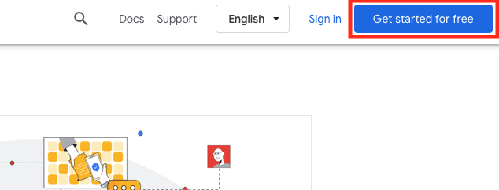
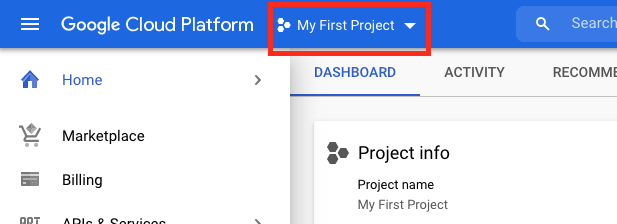

# Up and Running: Data Engineering on the Google Cloud Platform
The completely free E-Book for setting up and running a Data Engineering stack on Google Cloud Platform.

NOTE: This book is currently incomplete. If you find errors or would like to fill in the gaps, read the [Contributions section](https://github.com/Nunie123/data_engineering_on_gcp_book#user-content-contributions).

## Table of Contents
[Preface](https://github.com/Nunie123/data_engineering_on_gcp_book) <br>
**Chapter 1: Setting up a GCP Account** <br>
[Chapter 2: Setting up Batch Processing Orchestration with Composer and Airflow](https://github.com/Nunie123/data_engineering_on_gcp_book/blob/master/ch_2_orchestration.md) <br>
[Chapter 3: Building a Data Lake with Google Cloud Storage (GCS)](https://github.com/Nunie123/data_engineering_on_gcp_book/blob/master/ch_3_data_lake.md) <br>
[Chapter 4: Building a Data Warehouse with BigQuery](https://github.com/Nunie123/data_engineering_on_gcp_book/blob/master/ch_4_data_warehouse.md) <br>
Chapter 5: Setting up DAGs in Composer and Airflow <br>
Chapter 6: Setting up Event-Triggered Pipelines with Cloud Functions <br>
Chapter 7: Parallel Processing with DataProc and Spark <br>
Chapter 8: Streaming Data with Pub/Sub <br>
Chapter 9: Managing Credentials with Google Secret Manager <br>
Chapter 10: Creating a Local Development Environment <br>
Chapter 11: Infrastructure as Code with Terraform <br>
Chapter 12: Continuous Integration with Jenkins <br>
Chapter 13: Monitoring and Alerting <br>
Appendix A: Example Code Repository


---

# Chapter 1: Setting up a GCP Account

GCP usually allows you to perform the same task many different ways. They offer a console through their website, CLI tools, and libraries for a variety of languages. When possible, we'll stick to using CLI tools and Python libraries, as this allows us to put our commands for instantiating and configuring our infrastructure into version control.

However, there are going to be some things that must be done through GCP's website, and setting up an account is one of those things.

In this chapter I'll also show you how to install the command line tools, so we can avoid using the console in the future.

## Signing up for GCP
Head to [cloud.google.com](https://cloud.google.com/) and click "Get Started for Free". <br>


Next you'll link your GCP account to an existing Google account. GCP may suggest one by default. If you do not have a Google account you must create one before proceeding.

GCP will then request personal information, including billing information. Unfortunately, you must provide billing information before you can create an account. However, new accounts receive a $300 credit towards any charges, and GCP will notify you before it starts charging you for cloud services.

## Creating a Project

In GCP, a Project acts as a namespace under which services are organized, permissions are set, and billing is tracked. For example, if you wanted to copy a file in a GCS bucket you would need to provide the Project associated with that bucket, otherwise GCP will be unable to find the bucket. You can have resources from different Projects talk to each other without much difficulty, the Projects generally just act as namespaces to help you organize your infrastructure. For example, we'll be creating a Project for our development infrastructure, and a separate Project for our production infrastructure.

On the GCP Console you'll always see your current project listed at the top of the screen. If you just created a new account then GCP has created the "My First Project" Project for you. Click on the Project name, then in the window that appears select "Create New Project". 



On this next page you'll provide your project name, which can be anything (I'm using `de-book-dev`). This Project will be for our development environment. Also note that while your Project name can be anything, your Project ID must be unique across all of GCP, so GCP will auto-generate it based on the name you provide, but you can choose to pick your own. Click the "Create" button.


Once we have our GCP command line tools set up (discussed below) we will be able to create a project from the terminal using the command:
``` bash
> gcloud projects create de-book-dev
```

## Installing the GCP Command Line Tools

GCP offers several command line utilities, but fortunately they are all easily installed by installing and configuring Google Cloud SDK. Google Cloud SDK can be installed though your favorite package manager such as [Homebrew](https://formulae.brew.sh/cask/google-cloud-sdk) or [Snap](https://snapcraft.io/install/google-cloud-sdk/debian), or though curl (`curl https://sdk.cloud.google.com | bash`). You can find more installation options [here](https://cloud.google.com/sdk/docs/install).

Once installed, run:
``` bash
> gcloud init
```
Following the prompts you will create a profile and link it to the Google account you used to log in to GCP. Your browser will open and authenticate using the credentials you set for your GCP account. At the prompt, select the Project you wish to work on (for me that's `de-book-dev`). You can change this profile or create a new profile by running `gcloud init` again.

You now have access to the `gcloud`, `bq`, and `gsutil` command line tools. `gsutil` is used for managing Google Cloud Storage, `bq` is used for managing BigQuery, and `gcloud` is a general purpose utility. All three will be used within this book.

---

Next Chapter: [Chapter 2: Batch Processing Orchestration with Composer and Airflow](https://github.com/Nunie123/data_engineering_on_gcp_book/blob/master/ch_d_orchestration.md) <br>

